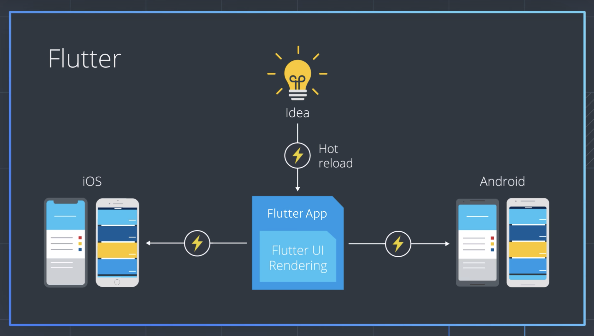
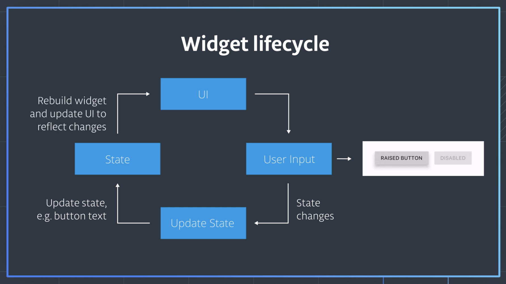

I start to study 'flutter' and find [the great site](https://www.udacity.com/) which is made by Google. Except for the best website [Flutter docs](https://flutter.dev/docs). I am just summerize contents that I think important.
`Every content is included in the udacity site.`
  

  

### 🧐 Why Flutter?
It can help to make smooth animations and great performance.
Also developer can do platform intergrations of native mobile app.
-> One codebase compiles to native arm code. There is no bridging between the framework and the widgets so rendering is efficient and animations are smoother.
  

### 😑 Why Dart?
If feels familiar with languages like javascript.
Performant in development and in production.
It supports both just-in-time and ahead-of-time compilation.
  

### Widget
Widgets are the foundatiton of Flutter apps. A widget is a description of part of a user interface. Nearly everything is a `widget` such as textbox, list, button, etc.

When a widget state changes, such as due to user input or animations, the widget rebuilds itself according to the new state. This saves developers' time because the UI can be described as functions of state. We don't have to write extra code for solely updatting the UI when state chages. 
  